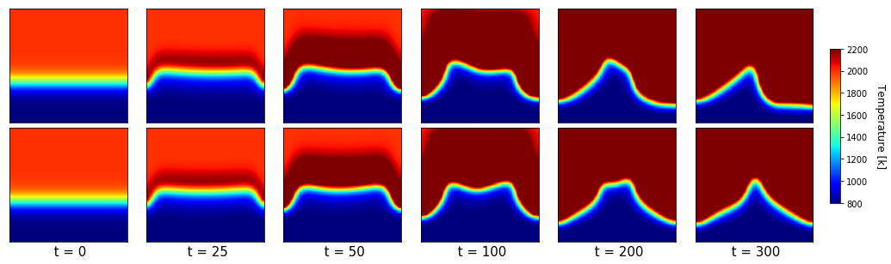
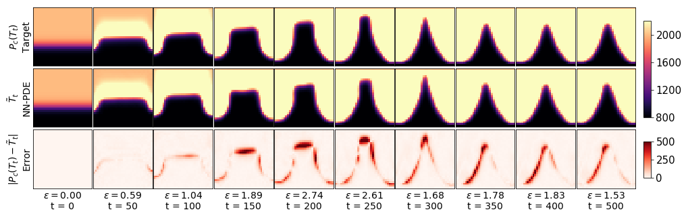
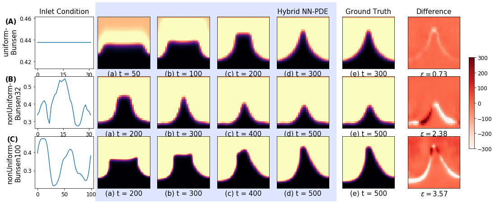

# Hybrid solution for Reactive Flows


# Tutorial
### Requirements
- TensorFlow 1.15
- PhiFlow 1.5.0

We recommend installing via pip, e.g., with ```pip install tensorflow-gpu==1.15 phiflow==1.5.0 ```

### Running the code
A makefile is included in a folder of each scenario. Running the scripts will generate training and test datasets, train a model and apply it to the test datasets. The repository includes all the scenarios discussed in the paper - Planar-v0, uniform-Bunsen, nonUniform-Bunsen32 and nonUniform-Bunsen100. Here, we provide an example with the nonUniform-Bunsen32 case, all other scenarios include similar files. 

### nonUniform-Bunsen32
You can generate the training and testing datasets by running:
```
make nonUniform-Bunsen32-react-set  # Generate training datasets
make nonUniform-Bunsen32-react-testset # Generate test datasets
```
This will create 300 time steps of training data for 12 different non-uniform inlet velocity excitations. Similarly, 12 test datasets are generated with different inlet velocity excitations. Here is a visualization of 2 training examples:



The hybrid NN-PDE model can be trained for m=2 using the following command. 
```
make NU-Bunsen32-hyb-unet-sol2 # Train a model
```

The hybrid NN-PDE model can be trained for m=32 using the following command. 
```
make NU-Bunsen32-hyb-unet-sol32 # Train a model
```
The model is initialized using the weights of the model with m=2 for stable training. This is done by using ```--resume``` option in the training file. *NU-Bunsen32-hyb-unet-sol32/tf* folder is created and the *dataStats.pickle* and *model_epoch100.h5* files obtained by running ```m=2``` model are copied into it. *solver_class_train_new.py* includes the PhiFlow implementation of the non-reactive flow solver. 

The trained neural network model can be used to predict the flame evolution at test conditions using the following command:
```
make NU-Bunsen32-hyb-unet-sol32/run_test # Run test
```
Given the initial conditions for temperature and mass fraction fields, it predicts the flame evolution over 300 time steps. It creates .npz files for temperature, mass fraction fields and velocity in *NU-Bunsen32-hyb-unet-sol32/run_test* folder for all testsets. Here is an example of the comparison between the output obtained using the trained hybrid NN-PDE solver with the ground truth data:



The codes related to the baseline method of purely data-driven (PDD) approach discussed in our paper are also included for each scenario in the respective directory. The PDD model can be trained and tested using *-pdd-* commands in respective makefiles.  


This work was supported by the ERC Consolidator Grant SpaTe (CoG-2019-863850).

Here is a visualization of different flame dynamics predicted using the hybrid NN-PDE approach.

